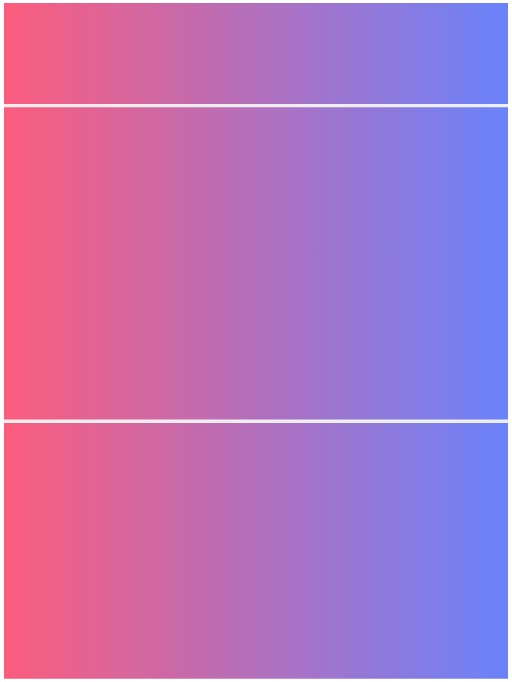

# Fixed Height Web Application using Angular Split (The Easy Way)

## Goal

In this article, I will be showing you how you can achieve a fixed height web application (which is usually the requirement for dashboard applications) using a library called [angular-split](https://angular-split.github.io/).

## Pre-requisites

Before you consider going ahead with a fixed height web application, it's good to have clarity about the following,

- List of resolutions you intend to support
- Layout for your content for all the supported resolutions

Wireframes can help you decide what resolutions you want to support and how you could arrange your content in the available space; optional but helpful if you have multiple developers working on a project or during discussions with different stakeholders in a project.

[Draw.io](https://draw.io/) is a great tool to create wireframes. Alright, I'll leave it at that. Now, let's dive into some code.

## Setting things up

Let's create a workspace for our application. You can refer to the Angular [documentation](https://angular.io/guide/setup-local) to set up your local development environment if you haven't already set things up.

```
ng new fixed-height-web-app
```

Angular CLI will ask you a couple of questions about your preferred stylesheet format and Angular routing. If you're unsure, just hit enter and go with the defaults.

After Angular CLI finishes installing all dependencies, serve the application to verify if your setup was successful.

```
ng serve --open
```

Now, using the command line utility, install the [angular-split](https://angular-split.github.io/) library.

```
npm install angular-split
```

After installing the library, remember to add the relevant imports in the App module.

Add the following import to your _app.module.ts_ file

```
import { AngularSplitModule } from 'angular-split';
```

The imports array of _NgModule_ should include the _AngularSplitModule_ that we have just imported

```
...
imports: [BrowserModule, AppRoutingModule, AngularSplitModule],
```

## Cut to the chase!

Now, let's add the main ingredient to our application, open the _app.component.html_ and replace it with the following code,

```
<as-split
  [disabled]="isSplitDisabled"
  [gutterSize]="7.5"
  [direction]="pageSplitDirection"
  unit="percent"
>
</as-split>
```

Open the _app.component.ts_ and add the following members to the class,

```
export class AppComponent {
    isSplitDisabled = true;
    pageSplitDirection: 'vertical' | 'horizontal' = 'vertical';

    ...
```

With the above code, we have created a parent container for the content of our page. Angular Split lets us create resizable areas (with the help of a draggable splitter control) within our container. I'm not going to cover that in this article. To know more about the various features **angular-split** has to offer, check out the examples section of their [website](https://angular-split.github.io/).

- We disable resizing by default by setting _isSplitDisabled_ to **true** and binding it to the _disabled_ property of **as-split** as shown in _app.component.html_.

- We set _pageSplitDirection_ to **'vertical'** and bind it to the _direction_ property, which gives us a column layout.

- The _gutterSize_ property is the visual gap we want to have between our child elements. I'm going with _7.5px_ folks.

- The _unit_ property is set to _percent_ as we want to provide sizes in percentages.

Now, let's give this parent container some child elements. Add the following to your _app.component.html_,

```
<as-split
  [disabled]="isSplitDisabled"
  [gutterSize]="7.5"
  [direction]="pageSplitDirection"
  unit="percent"
>
  <as-split-area [size]="headerSizeInPercent"></as-split-area>
  <as-split-area [size]="bodySizeInPercent">
    <as-split
      [disabled]="isSplitDisabled"
      [gutterSize]="7.5"
      [direction]="contentSplitDirection"
      unit="percent"
    >
      <as-split-area [size]="leftChildSizeInPercent"></as-split-area>
      <as-split-area [size]="rightChildSizeInPercent"></as-split-area>
    </as-split>
  </as-split-area>
</as-split>
```

We have added a header element and a body element within the container. Within the body, we've created another container and added a couple of child elements to that.

The _as-split-area_ is the element that reserves space for our content.

Let's go ahead and add the required members to the _app.component.ts_ file before the compiler starts complaining. Add the following members to the class,

```
export class AppComponent {
    isSplitDisabled = true;
    pageSplitDirection: 'vertical' | 'horizontal' = 'vertical';
    headerSizeInPercent = 20;
    bodySizeInPercent = 80;
    contentSplitDirection: 'vertical' | 'horizontal' = 'horizontal';
    leftChildSizeInPercent = 50;
    rightChildSizeInPercent = 50;

    ...
```

Style matters. To visualize what we've done so far, add the following styles,

> **Note:** Basing on the stylesheet format you've chosen during the initial setup, your stylesheet extension could change. If you had chosen to go with the defaults, you would end up with a _style.css_ and an _app.component.css_ file.

- styles.scss

  ```
  html, body {
      height: calc(100% - 7.5px);
  }
  ```

- app.component.scss

  ```
  as-split-area {
    background: linear-gradient(to bottom, #fc5c7d, #6a82fb);
  }

  ```

That's it! Our fixed-height web application is ready and should look something like this,


Let's go ahead and handle the portrait orientation as well. For the portrait orientation, let's have a column layout for all elements.

Let's create a method called _computeLayout_ that sets the layout for different resolutions. Add the following to our _AppComponent_ (in the _app.component.ts_ file).

```
private computeLayout() {
    // landscape
    if (window.innerWidth > window.innerHeight) {
        this.contentSplitDirection = 'horizontal';
        this.headerSizeInPercent = 20;
        this.bodySizeInPercent = 80;
        this.leftChildSizeInPercent = 50;
        this.rightChildSizeInPercent = 50;
    }
    // portrait
    else {
        this.contentSplitDirection = 'vertical';
        this.headerSizeInPercent = 15;
        this.bodySizeInPercent = 85;
        this.leftChildSizeInPercent = 55;
        this.rightChildSizeInPercent = 45;
    }
}
```

We need to invoke the _computeLayout_ method whenever a window resize happens. To do that, we need to listen to the window resize events. Add the following to our _AppComponent_ (in the _app.component.ts_ file).

```
export class AppComponent implements OnInit, OnDestroy {
    private resizeObservable$: Observable<Event> | null;
    private resizeSubscription$!: Subscription;

    ...

    constructor() {
        this.resizeObservable$ = null;
    }

    ngOnInit(): void {
        this.computeLayout();

        this.resizeObservable$ = fromEvent(window, 'resize');
        this.resizeSubscription$ = this.resizeObservable$?.subscribe({
            next: () => this.computeLayout(),
        });
    }

    ngOnDestroy(): void {
        this.resizeSubscription$?.unsubscribe();
    }

    ...
```

Let's add a teeny tiny change to our stylesheet. Modify the _app.component.scss_ file to look like the following,

```
as-split-area {
    background: linear-gradient(to bottom, #fc5c7d, #6a82fb);
}

@media (orientation: portrait) {
    as-split-area {
        background: linear-gradient(to right, #fc5c7d, #6a82fb);
    }
}
```

Voila! Our layout is dynamic now. If we changed to portrait mode, our page would like this (and there's no scroll bar!),



This approach is the quickest and easiest way to achieve a dynamic fixed-height layout for your application.

## Caution

Restricting the height of an application comes with its challenges. You might end up not supporting a lot of mobile devices because your content just won't fit. However, the absence of a scroll bar makes it a breeze to interact with the application and displays everything at one glance, a perfect fit for dashboards.

## Until next time

This is my first article (first of many); I'm looking for some feedback. So, please do let me know if you think there should be less of one thing, more of another, or, even if you just liked it!

In one of my articles that will follow, I wish to cover how one could achieve the same by writing a custom Angular directive. Until then, happy coding! 🙂
